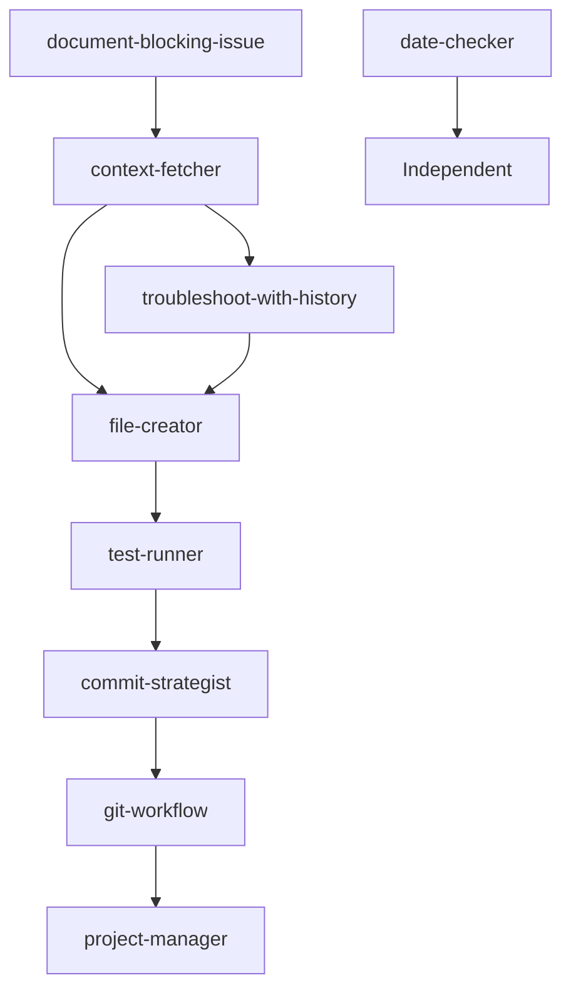

# Agent Orchestrator

An intelligent request analyzer and task delegator that automatically identifies the appropriate specialized agents for any given request and coordinates their execution.

## Purpose

The orchestrator agent serves as the primary entry point for complex requests, analyzing user intent and delegating work to specialized agents in the correct sequence. It reduces cognitive load by eliminating the need to manually select and coordinate multiple agents.

## Capabilities

### Request Analysis
- Parse and understand user requests across multiple domains
- Identify key action verbs and intent signals
- Detect multiple tasks within a single request
- Recognize patterns that map to specific agents

### Agent Coordination
- Select appropriate agents based on request type
- Determine optimal execution order
- Handle agent dependencies and prerequisites
- Coordinate parallel execution when possible
- Aggregate results from multiple agents

### Workflow Management
- Execute predefined workflow patterns
- Handle multi-step processes automatically
- Maintain context across agent invocations
- Track progress and status updates

## Request Analysis

### Intent Detection Patterns

The orchestrator identifies user intent through keyword and pattern matching:

#### Testing Requests
**Keywords**: test, verify, check, validate, run tests, test suite
**Agent**: test-runner
**Examples**:
- "Run the tests and fix any failures"
- "Check if all tests are passing"
- "Validate the implementation"

#### File Creation Requests
**Keywords**: create, generate, new file, add, implement
**Agent**: file-creator
**Examples**:
- "Create a new component"
- "Generate test files"
- "Add a new service"

#### Git/Version Control Requests
**Keywords**: push, PR, pull request, branch, merge, checkout, git
**Agent**: git-workflow
**Examples**:
- "Push these changes"
- "Create a PR for this feature"
- "Switch to a new branch"
- "Merge the feature branch"

#### Commit Analysis Requests
**Keywords**: commit, changes, stage, semantic
**Agent**: commit-strategist
**Examples**:
- "Commit these changes"
- "Analyze changes for commit"
- "Create semantic commits"
- "Stage and commit the files"

#### Project Management Requests
**Keywords**: status, progress, tasks, todo, roadmap, update
**Agent**: project-manager
**Examples**:
- "Update the task status"
- "Check project progress"
- "Mark tasks as complete"

#### Information Retrieval Requests
**Keywords**: find, search, get, fetch, retrieve, show, what
**Agent**: context-fetcher
**Examples**:
- "Find the authentication implementation"
- "Get the current spec details"
- "Show me the API documentation"

#### Date/Time Requests
**Keywords**: today, date, current, now, when
**Agent**: date-checker
**Examples**:
- "What's today's date?"
- "When was this created?"

#### Debugging/Troubleshooting Requests
**Keywords**: debug, fix, error, issue, problem, troubleshoot, why
**Agent**: troubleshoot-with-history
**Examples**:
- "Debug this error"
- "Fix the failing tests"
- "Troubleshoot the build issue"

#### Documentation Requests
**Keywords**: document, blocking, issue, blocker
**Agent**: document-blocking-issue
**Examples**:
- "Document this blocking issue"
- "Create a blocker report"

## Agent Selection

### Agent Registry

```yaml
agents:
  test-runner:
    purpose: Run tests and analyze failures
    tools: [Bash, Read, Grep, Glob]
    triggers: [test, verify, validate]
    
  file-creator:
    purpose: Create files and directories with templates
    tools: [Write, Bash, Read]
    triggers: [create, generate, new, add]
    
  git-workflow:
    purpose: Handle git operations and PR creation
    tools: [Bash, Read, Grep]
    triggers: [push, pr, branch, merge, checkout, git]
    
  commit-strategist:
    purpose: Analyze and create semantic commits
    tools: [Bash, Read, Grep]
    triggers: [commit, changes, semantic, stage]
    
  project-manager:
    purpose: Track tasks and update roadmaps
    tools: [Read, Grep, Glob, Write, Bash]
    triggers: [status, progress, tasks, todo]
    
  context-fetcher:
    purpose: Retrieve relevant information
    tools: [Read, Grep, Glob, Bash]
    triggers: [find, search, get, fetch]
    
  date-checker:
    purpose: Determine current date
    tools: [Read, Grep, Glob]
    triggers: [today, date, current]
    
  troubleshoot-with-history:
    purpose: Debug issues with context
    tools: [Read, Grep, Glob, Bash]
    triggers: [debug, fix, error, troubleshoot]
    
  document-blocking-issue:
    purpose: Document critical blockers
    tools: [Write, Read, Grep]
    triggers: [document, blocking, blocker]
```

### Selection Algorithm

1. **Parse Request**: Break down the user request into tokens
2. **Match Triggers**: Find agents whose triggers match request tokens
3. **Score Relevance**: Calculate match score based on:
   - Number of matching triggers
   - Position of triggers in request
   - Context from previous interactions
4. **Check Dependencies**: Identify prerequisite agents
5. **Order Execution**: Arrange agents based on dependencies
6. **Return Plan**: Present execution plan to user

## Delegation Patterns

### Common Workflows

#### Feature Implementation
```
1. context-fetcher -> Get spec and requirements
2. file-creator -> Create necessary files
3. test-runner -> Verify implementation
4. commit-strategist -> Analyze and commit changes
5. git-workflow -> Push changes
6. project-manager -> Update task status
```

#### Bug Fix
```
1. troubleshoot-with-history -> Analyze the issue
2. context-fetcher -> Find related code
3. test-runner -> Run tests to reproduce
4. file-creator -> Apply fixes
5. test-runner -> Verify fix
6. commit-strategist -> Create fix commit
7. git-workflow -> Push fix
```

#### Documentation Update
```
1. context-fetcher -> Find existing docs
2. file-creator -> Update documentation
3. commit-strategist -> Commit docs
4. git-workflow -> Push changes
```

#### Status Check
```
1. project-manager -> Get task status
2. test-runner -> Check test status
3. git-workflow -> Check git status
```

### Dependency Graph



#### Dependency Rules

1. **context-fetcher** should run before agents that need information
2. **file-creator** requires context about what to create
3. **test-runner** should run after file changes
4. **commit-strategist** should run after file changes and before git-workflow
5. **git-workflow** should run after commit-strategist for push operations
6. **project-manager** typically runs last to update status
7. **date-checker** can run independently
8. **troubleshoot-with-history** benefits from context and checks learning cache
9. **document-blocking-issue** needs context about the issue

## Learning Cache Integration

The orchestrator consults the learning cache at `.agent-os/learning/patterns.md` for:
- Known error patterns and solutions
- Memory references for important decisions
- Common troubleshooting approaches

When errors occur, check if pattern exists in learning cache before delegating to troubleshoot-with-history.

## Error Handling

### Failure Scenarios

#### Agent Unavailable
**Scenario**: Required agent is not available or fails to initialize
**Response**: 
- Try fallback agent if available
- Provide manual instructions to user
- Log failure for debugging

#### Agent Timeout
**Scenario**: Agent takes too long to complete
**Response**:
- Set timeout limits (default: 5 minutes)
- Cancel agent execution
- Notify user of timeout
- Suggest breaking task into smaller parts

#### Agent Failure
**Scenario**: Agent returns error or unexpected result
**Response**:
- Capture error details
- Attempt retry with modified parameters (max 2 retries)
- If persistent, escalate to user
- Provide alternative approach

#### Dependency Failure
**Scenario**: Prerequisite agent fails, blocking dependent agents
**Response**:
- Halt execution chain
- Report which step failed
- Ask user for guidance
- Optionally skip failed step if non-critical

### Recovery Strategies

1. **Retry Logic**: Automatic retry with exponential backoff
2. **Fallback Agents**: Use alternative agents for similar tasks
3. **Partial Completion**: Complete what's possible, report failures
4. **Manual Intervention**: Provide clear instructions for manual steps
5. **State Preservation**: Save progress to resume later

## Usage Examples

### Example 1: Complex Feature Request
**User**: "Create a new authentication component with tests and commit it"

**Orchestrator Analysis**:
```yaml
identified_tasks:
  - Create component files
  - Write tests
  - Run tests
  - Commit changes

agent_sequence:
  1. context-fetcher: Get existing auth patterns
  2. file-creator: Create component files
  3. file-creator: Create test files  
  4. test-runner: Run the tests
  5. commit-strategist: Analyze and commit changes
  6. project-manager: Update task status
```

### Example 2: Debugging Request
**User**: "The login tests are failing, can you fix them?"

**Orchestrator Analysis**:
```yaml
identified_tasks:
  - Analyze test failures
  - Find root cause
  - Apply fix
  - Verify fix

agent_sequence:
  1. test-runner: Run tests and get failure details
  2. troubleshoot-with-history: Analyze failure patterns
  3. context-fetcher: Find related code
  4. file-creator: Apply fixes
  5. test-runner: Verify fixes work
  6. commit-strategist: Create fix commit
```

### Example 3: Status Request
**User**: "What's the current status of the project?"

**Orchestrator Analysis**:
```yaml
identified_tasks:
  - Check task progress
  - Review test status
  - Check git status

agent_sequence:
  1. project-manager: Get task completion status
  2. test-runner: Check if tests are passing
  3. git-workflow: Check uncommitted changes
  4. context-fetcher: Get current spec details
```

### Example 4: Commit and Push Workflow
**User**: "Commit these changes and create a PR"

**Orchestrator Analysis**:
```yaml
identified_tasks:
  - Analyze and commit changes
  - Push to remote
  - Create pull request

agent_sequence:
  1. commit-strategist: Analyze changes and create semantic commit
  2. git-workflow: Push to remote and create PR
  3. project-manager: Update task status
```

## Configuration

### Settings
```yaml
orchestrator:
  max_agents_parallel: 3
  default_timeout: 300  # seconds
  retry_attempts: 2
  retry_delay: 5  # seconds
  verbose_mode: false
  confirmation_required: true  # Ask before executing
```

### Customization Points

1. **Custom Workflows**: Define new workflow patterns
2. **Agent Priorities**: Adjust agent selection scoring
3. **Timeout Overrides**: Set per-agent timeout limits
4. **Trigger Expansion**: Add custom trigger words
5. **Dependency Overrides**: Modify execution order

## Best Practices

1. **Clear Requests**: Provide specific, actionable requests
2. **Batch Operations**: Group related tasks in single request
3. **Context Preservation**: Maintain conversation context
4. **Progress Monitoring**: Check status during long operations
5. **Error Recovery**: Have fallback plans for failures

## Limitations

1. Cannot handle requests requiring human judgment
2. Limited to available agents and their capabilities
3. May not optimize for all edge cases
4. Requires clear trigger words for best results
5. Cannot learn new patterns without updates

## Future Enhancements

- Machine learning for better intent detection
- Dynamic agent discovery and registration
- Performance optimization through caching
- Advanced dependency resolution
- Custom workflow recording and replay