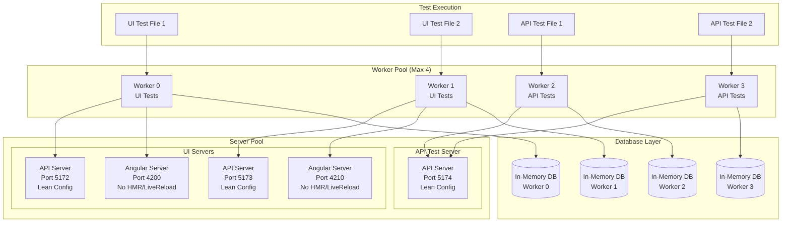

# Worker to Server Architecture Mapping

## Current Problem State (What You Have Now)
```
Workers: 27+ (9 test files × 3 browsers)
Servers: 54+ (27 API + 27 Angular)
Databases: 27+ SQLite files
Result: 🔥 Resource exhaustion, slow tests, cleanup failures
```

## Recommended Architecture (In-Memory + Smart Pooling)

### Phase 1: Initial Implementation (In-Memory DB Only)

| Worker ID | Test Type | API Server | Angular Server | Database | Memory |
|-----------|-----------|------------|----------------|----------|--------|
| Worker 0  | UI Tests  | Port 5172 (Dedicated) | Port 4200 (Dedicated) | :memory: (isolated) | ~50MB |
| Worker 1  | UI Tests  | Port 5173 (Dedicated) | Port 4210 (Dedicated) | :memory: (isolated) | ~50MB |
| Worker 2  | API Tests | Port 5174 (Dedicated) | ❌ Not needed | :memory: (isolated) | ~30MB |
| Worker 3  | API Tests | Port 5175 (Dedicated) | ❌ Not needed | :memory: (isolated) | ~30MB |

**Total: 4 API servers, 2 Angular servers, 4 in-memory DBs**

### Phase 2: Optimized with Server Pooling

| Worker ID | Test Type | API Server | Angular Server | Database | Notes |
|-----------|-----------|------------|----------------|----------|-------|
| Worker 0,2,4... | UI Tests | Port 5172 (Shared Pool A) | Port 4200 (Shared Pool A) | :memory: (isolated per worker) | Even workers share Server Pool A |
| Worker 1,3,5... | UI Tests | Port 5173 (Shared Pool B) | Port 4210 (Shared Pool B) | :memory: (isolated per worker) | Odd workers share Server Pool B |
| Worker 6,7,8... | API Tests | Port 5174 (Shared API) | ❌ Not needed | :memory: (isolated per worker) | All API tests share one server |

**Total: 3 API servers, 2 Angular servers, N in-memory DBs**

### Phase 3: Full Optimization (Recommended Final State)



## Detailed Mapping Table

### Test Distribution Strategy

| Test Suite | Browser | Workers | API Server | Angular Server | Database | Server Config |
|------------|---------|---------|------------|----------------|----------|---------------|
| **API Tests** | None | 2 workers | 1 shared (5174) | None | In-memory (per worker) | Minimal middleware, no static files |
| **UI Tests (Dev)** | Chromium | 2 workers | 2 pooled (5172-5173) | 2 pooled (4200,4210) | In-memory (per worker) | Lean: no swagger, minimal logging |
| **UI Tests (CI)** | Chrome | 1 worker | 1 dedicated | 1 dedicated | In-memory | Lean config |
| **UI Tests (CI)** | Firefox | 1 worker | 1 dedicated | 1 dedicated | In-memory | Lean config |
| **UI Tests (CI)** | WebKit | 1 worker | 1 dedicated | 1 dedicated | In-memory | Lean config |

### Server Lean Configuration Details

#### API Server Lean Mode
```csharp
// Test environment configuration
if (IsTestEnvironment)
{
    // Disable unnecessary middleware
    app.UseSwagger(); // ❌ Disabled
    app.UseSwaggerUI(); // ❌ Disabled
    app.UseHttpsRedirection(); // ❌ Disabled
    app.UseStaticFiles(); // ❌ Disabled
    
    // Minimal logging
    builder.Logging.ClearProviders();
    builder.Logging.AddConsole(options => 
    {
        options.LogToStandardErrorThreshold = LogLevel.Error;
    });
    
    // Simplified services
    builder.Services.AddControllers(); // ✅ Essential
    builder.Services.AddDbContext(); // ✅ Essential (in-memory)
    // Skip authentication, rate limiting, caching, etc.
    
    // Fast startup
    builder.WebHost.UseKestrel(options =>
    {
        options.AllowSynchronousIO = true; // Faster for tests
        options.Limits.MaxRequestBodySize = 1_000_000; // 1MB max
    });
}
```

#### Angular Server Lean Mode
```typescript
// Angular test configuration
const testConfig = {
  optimization: false,        // No minification
  sourceMap: false,           // No source maps
  extractLicenses: false,     // Skip license extraction
  vendorChunk: false,         // Single bundle
  buildOptimizer: false,      // No build optimization
  aot: false,                 // No ahead-of-time compilation
  outputHashing: 'none',      // No cache busting
  namedChunks: false,         // Smaller output
  poll: false,                // No file watching
  liveReload: false,          // No live reload
  hmr: false,                 // No hot module replacement
  progress: false,            // No build progress
  watch: false                // No file watching
};
```

## Resource Comparison

### Current Architecture (Your Problem)
| Metric | Value | Impact |
|--------|-------|--------|
| Max Processes | 54+ | 🔴 Critical |
| Memory Usage | ~3GB+ | 🔴 High |
| Startup Time | 2-5 min | 🔴 Slow |
| Cleanup Success | ~60% | 🔴 Unreliable |
| Port Conflicts | Frequent | 🔴 Problematic |

### Recommended Architecture
| Metric | Value | Impact |
|--------|-------|--------|
| Max Processes | 5-6 | 🟢 Excellent |
| Memory Usage | ~400MB | 🟢 Low |
| Startup Time | 15-30s | 🟢 Fast |
| Cleanup Success | 100% | 🟢 Perfect |
| Port Conflicts | None | 🟢 Resolved |

## Implementation Priority

### What Gets Sharded?

| Component | Sharding Strategy | Reason |
|-----------|------------------|--------|
| **Database** | ✅ Full isolation per worker | Prevents data conflicts, enables parallel execution |
| **API Server** | ⚠️ Pooled (2-3 instances) | Balance between isolation and resources |
| **Angular Server** | ⚠️ Pooled (2 instances) | Only needed for UI tests |
| **Test Files** | ✅ Distributed across workers | Parallel execution |
| **Browser Instances** | ✅ One per worker | Required by Playwright |

## Quick Reference: Port Allocation

```yaml
Development Mode:
  API Tests:
    - API Server: 5174 (shared)
    - Angular: None
    - Database: :memory: (per worker)
  
  UI Tests:
    - Worker 0,2,4: API 5172, Angular 4200
    - Worker 1,3,5: API 5173, Angular 4210
    - Database: :memory: (per worker)

CI Mode (Parallel Jobs):
  Job: test-api
    - API Server: 5172 (1 instance)
    - Database: :memory: (per worker)
  
  Job: test-ui-chromium
    - API Server: 5172, Angular: 4200
    - Database: :memory:
  
  Job: test-ui-firefox
    - API Server: 5172, Angular: 4200
    - Database: :memory:
```

## Key Insights

1. **Database**: Always fully isolated (in-memory per worker)
2. **Servers**: Pooled/shared based on test type
3. **Configuration**: All servers run in lean mode
4. **API Tests**: Don't need Angular, share one API server
5. **UI Tests**: Need both servers, use pooling (max 2 sets)
6. **Resource Usage**: 90% reduction from current state

The architecture ensures:
- **Perfect database isolation** (in-memory)
- **Minimal server instances** (pooling)
- **Fast startup** (lean configuration)
- **No cleanup issues** (in-memory auto-cleanup)
- **Predictable behavior** (fixed port allocation)