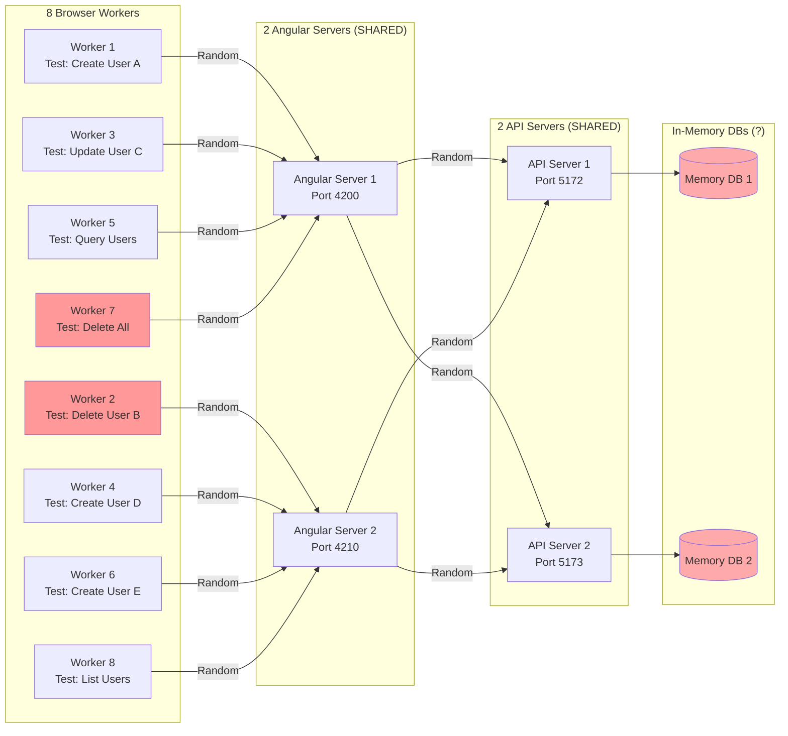
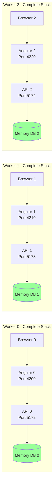
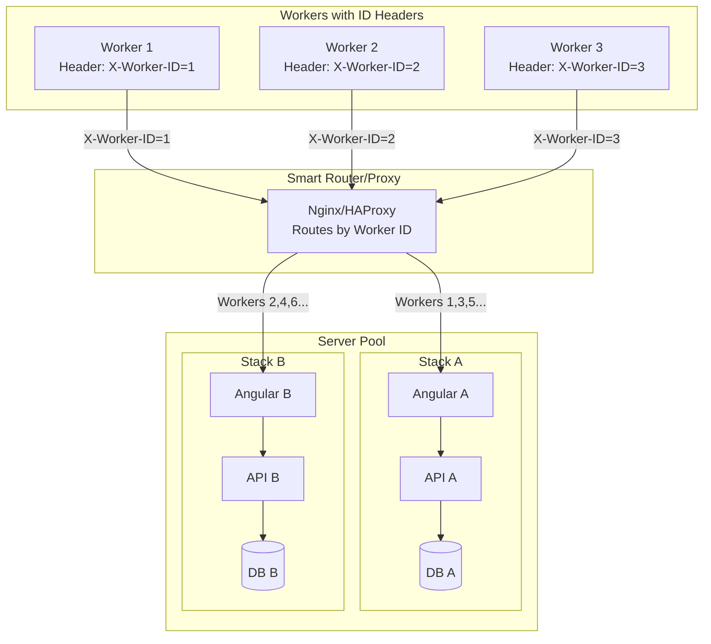
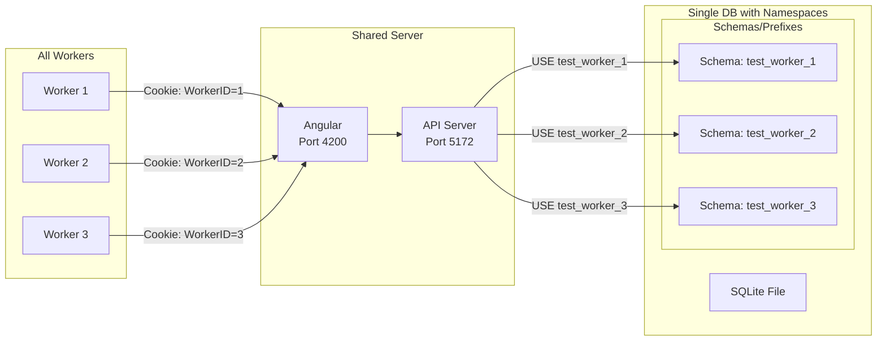

# The Isolation Problem - You're Right!

## The Flawed Architecture (What I Incorrectly Proposed)



### 🔴 THE PROBLEM: No Request Routing!

When Worker 1 makes a request:
1. Browser (Worker 1) → Angular Server (1 or 2?) - **RANDOM!**
2. Angular Server → API Server (1 or 2?) - **RANDOM!**
3. API Server → Database - **WRONG DATABASE!**

**Result**: Worker 1's test data might end up in Database 2, Worker 2 reads from Database 1, **TOTAL CHAOS!**

## Why This Doesn't Work

| Step | Problem | Impact |
|------|---------|--------|
| Browser → Angular | No worker identification | Can't route to correct server |
| Angular → API | No worker context passed | Can't select correct API |
| API → Database | Wrong database accessed | Tests see each other's data! |

## The Real Issue: HTTP is Stateless!

```
Worker 1: "Create User 'Alice'"
  → Goes to Angular Server 1
  → Goes to API Server 2
  → Writes to Database 2

Worker 2: "List all users"
  → Goes to Angular Server 2
  → Goes to API Server 1
  → Reads from Database 1
  → ❌ Doesn't see 'Alice'!

Worker 3: "Delete all users"
  → Goes to Angular Server 1
  → Goes to API Server 2
  → Deletes from Database 2
  → ❌ Just deleted Worker 1's data!
```

## The Truth: You CAN'T Share Servers with True Isolation

For true isolation, you need ONE of these approaches:

### Option 1: Full Server Isolation (What Actually Works)



**Result**: TRUE ISOLATION but need 3×N servers for N workers!

### Option 2: Request Routing with Worker ID (Complex)



### Option 3: Database Namespacing (Shared Servers, Isolated Data)



## The Harsh Reality

### ❌ What DOESN'T Work (My Flawed Proposal)
- Shared servers with separate databases
- No request routing mechanism
- Hoping requests magically find the right database

### ✅ What ACTUALLY Works

#### For True E2E Test Isolation, You Must Choose:

| Approach | Servers | Complexity | True Isolation | Best For |
|----------|---------|------------|----------------|----------|
| **1. One Stack Per Worker** | N×3 servers | Simple | ✅ Perfect | Small test suites, powerful machines |
| **2. Worker ID Routing** | 2-3 stacks + proxy | Complex | ✅ Perfect | Large test suites with routing infrastructure |
| **3. Database Namespacing** | 1 stack | Medium | ⚠️ Partial | API tests, careful test design |
| **4. Test Serialization** | 1 stack | Simple | ✅ Perfect | Small suites, slow execution OK |

## Your Best Option Given the Constraints

### Recommended: Modified Option 1 - Limited Worker Pool

```typescript
// playwright.config.ts
export default defineConfig({
  workers: 2, // MAX 2 WORKERS - This is KEY!
  
  projects: [
    { name: 'chromium' } // Single browser
  ],
});
```

```typescript
// test-fixture.ts
export const test = base.extend({
  workerServerManager: [async ({ }, use, workerInfo) => {
    // Only support exactly 2 workers
    if (workerInfo.workerIndex > 1) {
      throw new Error('Maximum 2 workers supported for true isolation');
    }
    
    const ports = {
      0: { api: 5172, angular: 4200 },
      1: { api: 5173, angular: 4210 }
    };
    
    // Each worker gets dedicated stack
    const server = new WorkerServer(ports[workerInfo.workerIndex]);
    await server.start();
    await use(server);
    await server.stop();
  }, { scope: 'worker' }]
});
```

With 2 workers:
- Worker 0: Angular 4200 → API 5172 → Memory DB 0
- Worker 1: Angular 4210 → API 5173 → Memory DB 1
- **TRUE ISOLATION GUARANTEED**

## The Trade-offs

| Workers | Servers | Isolation | Speed | Resource Use |
|---------|---------|-----------|-------|--------------|
| 1 | 2 (1 API, 1 Angular) | Perfect | Slow | Low |
| 2 | 4 (2 API, 2 Angular) | Perfect | Good | Acceptable |
| 4 | 8 (4 API, 4 Angular) | Perfect | Fast | High |
| 8 (shared) | 4 (2 API, 2 Angular) | **BROKEN** | Fast | Low |

## The Answer to Your Question

**"How does it stay isolated?"**

**It doesn't!** The architecture I initially proposed is fundamentally flawed. You can't share servers across workers and maintain isolation without:
1. Request routing based on worker ID (complex)
2. Database namespacing with worker context (complex)
3. Accepting one complete server stack per worker (resource intensive)

The only simple solution that guarantees isolation: **Each worker needs its own complete server stack.**

## What Should You Actually Do?

### For Development:
```bash
npm test -- --workers=1  # Slow but reliable
```

### For CI:
```yaml
strategy:
  matrix:
    shard: [1, 2]  # Run 2 shards in parallel CI jobs
    
steps:
  - run: npm test -- --shard=${{ matrix.shard }}/2 --workers=1
```

This gives you:
- True isolation (each job has dedicated servers)
- Parallel execution (via CI matrix)
- No resource exhaustion locally
- Reliable, predictable tests