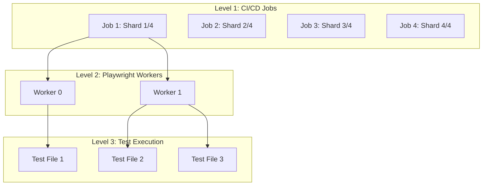
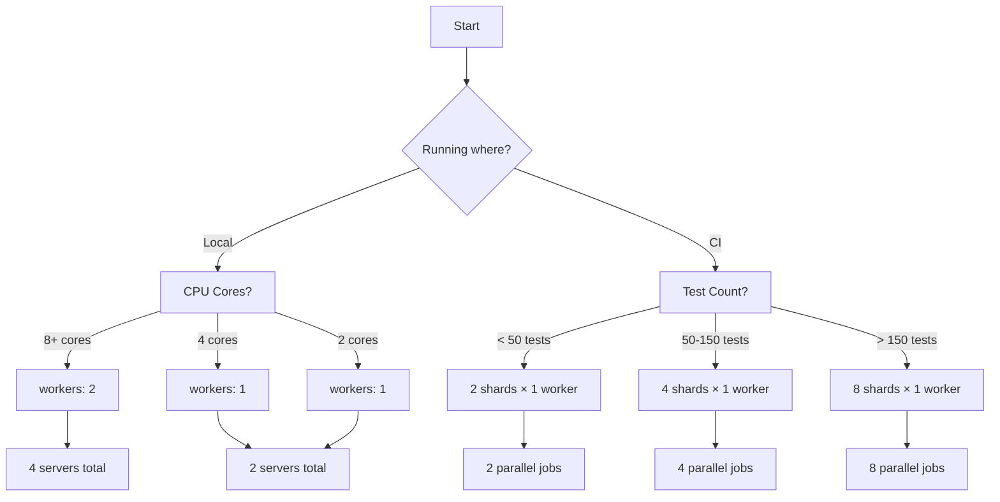

# Parallel Execution Control Guide

## Three Levels of Parallelism



## 1. Local Parallel Execution (Playwright Workers)

### Setting Worker Count

```bash
# Command line
npm test -- --workers=2              # Explicitly set 2 workers
npm test -- --workers=50%            # 50% of CPU cores
npm test -- --workers=1              # Serial execution

# Environment variable
PWTEST_WORKERS=2 npm test            # Via environment

# Config file (playwright.config.ts)
export default defineConfig({
  workers: process.env.CI ? 2 : 1,   # Conditional
  workers: 4,                        # Fixed number
  workers: '50%',                    # Percentage of CPUs
});
```

### How Playwright Determines Default Workers

```typescript
// Playwright's default logic (simplified)
const defaultWorkers = process.env.CI 
  ? Math.ceil(os.cpus().length / 2)  // 50% of cores in CI
  : Math.ceil(os.cpus().length / 4); // 25% of cores locally

// On your machine (example: 8-core CPU)
// Local: 2 workers by default
// CI: 4 workers by default
```

## 2. CI/CD Parallel Jobs (GitHub Actions)

### GitHub Actions Matrix Strategy

```yaml
# .github/workflows/e2e-tests.yml
name: E2E Tests

on: [push, pull_request]

jobs:
  test:
    strategy:
      matrix:
        # This creates 4 parallel jobs
        shard: [1, 2, 3, 4]
        
    runs-on: ubuntu-latest
    
    steps:
      - uses: actions/checkout@v3
      
      - name: Run E2E Tests (Shard ${{ matrix.shard }}/4)
        run: |
          # Each job runs 1/4 of the tests
          npm test -- --shard=${{ matrix.shard }}/4 --workers=1
```

### Dynamic Parallel Jobs Based on Test Count

```yaml
jobs:
  prepare:
    runs-on: ubuntu-latest
    outputs:
      matrix: ${{ steps.set-matrix.outputs.matrix }}
    steps:
      - uses: actions/checkout@v3
      
      - id: set-matrix
        run: |
          # Count test files and determine shards
          TEST_COUNT=$(find tests -name "*.spec.ts" | wc -l)
          SHARDS=$(( (TEST_COUNT + 2) / 3 ))  # 3 tests per shard
          
          # Create matrix JSON
          MATRIX=$(seq 1 $SHARDS | jq -R -s -c 'split("\n")[:-1] | map(tonumber)')
          echo "matrix=$MATRIX" >> $GITHUB_OUTPUT
  
  test:
    needs: prepare
    strategy:
      matrix:
        shard: ${{ fromJson(needs.prepare.outputs.matrix) }}
    runs-on: ubuntu-latest
    steps:
      - run: npm test -- --shard=${{ matrix.shard }}/${{ strategy.job-total }}
```

## 3. Test Sharding (Distributing Tests Across Jobs)

### Playwright's Built-in Sharding

```bash
# Run first quarter of tests
npm test -- --shard=1/4

# Run second quarter of tests  
npm test -- --shard=2/4

# Sharding with multiple workers per shard
npm test -- --shard=1/2 --workers=2
```

### How Sharding Works

```typescript
// Tests are distributed deterministically
Total tests: 100
Shard 1/4: Tests 1-25
Shard 2/4: Tests 26-50
Shard 3/4: Tests 51-75
Shard 4/4: Tests 76-100

// Each shard can still use multiple workers
Shard 1/4 with 2 workers:
  Worker 0: Tests 1,3,5,7...
  Worker 1: Tests 2,4,6,8...
```

## Optimal Configurations

### For Your Architecture (With Isolation Requirements)

#### Local Development
```typescript
// playwright.config.local.ts
export default defineConfig({
  workers: 1, // Single worker = full isolation, no conflicts
  fullyParallel: false, // Run tests sequentially
});
```

```bash
npm test -- --workers=1
```

#### CI Pipeline (Recommended)
```yaml
# .github/workflows/e2e-tests.yml
jobs:
  test-e2e:
    strategy:
      fail-fast: false  # Don't stop other shards if one fails
      matrix:
        shard: [1, 2, 3, 4]  # 4 parallel jobs
        
    runs-on: ubuntu-latest
    
    steps:
      - uses: actions/checkout@v3
      
      - name: Setup Node
        uses: actions/setup-node@v3
        with:
          node-version: 20
          
      - name: Install dependencies
        run: |
          cd test/Tests.E2E.NG
          npm ci
          npx playwright install chromium
      
      - name: Run tests (Shard ${{ matrix.shard }}/4)
        run: |
          cd test/Tests.E2E.NG
          npm test -- \
            --shard=${{ matrix.shard }}/4 \
            --workers=1 \
            --reporter=json \
            --reporter=html
            
      - name: Upload test results
        if: always()
        uses: actions/upload-artifact@v3
        with:
          name: test-results-shard-${{ matrix.shard }}
          path: test/Tests.E2E.NG/test-results/
```

### Resource Usage Comparison

| Configuration | Parallel Jobs | Workers/Job | Total Workers | Servers | Isolation | Speed |
|--------------|---------------|-------------|---------------|---------|-----------|--------|
| **Local Dev** | 1 | 1 | 1 | 2 | ✅ Perfect | ⚠️ Slow |
| **Local Fast** | 1 | 2 | 2 | 4 | ✅ Perfect | ✅ Good |
| **CI Optimal** | 4 | 1 | 4 | 8 total (2 per job) | ✅ Perfect | ✅ Fast |
| **CI Maximum** | 8 | 1 | 8 | 16 total (2 per job) | ✅ Perfect | ✅ Fastest |
| **Bad: Shared** | 1 | 8 | 8 | 4 | ❌ None | ❌ Flaky |

## Setting Parallel Jobs: Decision Tree



## Practical Examples

### 1. Fast Local Testing (2 workers, full isolation)
```json
// package.json
{
  "scripts": {
    "test:fast": "playwright test --workers=2",
    "test:safe": "playwright test --workers=1"
  }
}
```

### 2. CI with 4 Parallel Jobs
```yaml
strategy:
  matrix:
    shard: [1, 2, 3, 4]
    
# Result: 4 GitHub Actions jobs run simultaneously
# Each job: 1 worker, 2 servers, perfect isolation
# Total time: ~25% of serial execution
```

### 3. Dynamic Scaling Based on Test Count
```bash
#!/bin/bash
# scripts/determine-shards.sh

TEST_COUNT=$(find tests -name "*.spec.ts" | wc -l)

if [ $TEST_COUNT -lt 20 ]; then
  echo "1"  # 1 shard for small suites
elif [ $TEST_COUNT -lt 50 ]; then
  echo "2"  # 2 shards for medium suites
elif [ $TEST_COUNT -lt 100 ]; then
  echo "4"  # 4 shards for large suites
else
  echo "8"  # 8 shards for very large suites
fi
```

## The Bottom Line

### For Your Specific Needs:

#### Local Development:
```bash
npm test -- --workers=1  # Safe, reliable, slower
# OR
npm test -- --workers=2  # If you have 8+ CPU cores
```

#### CI Pipeline:
```yaml
matrix:
  shard: [1, 2, 3, 4]  # 4 parallel jobs
  
run: npm test -- --shard=${{ matrix.shard }}/4 --workers=1
```

This gives you:
- **Local**: 1-2 workers = 2-4 servers = manageable
- **CI**: 4 parallel jobs × 1 worker each = fast execution
- **Total CI time**: ~25% of serial execution
- **Perfect isolation**: Each worker has dedicated servers
- **No flakiness**: No shared state between tests