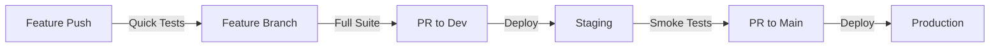
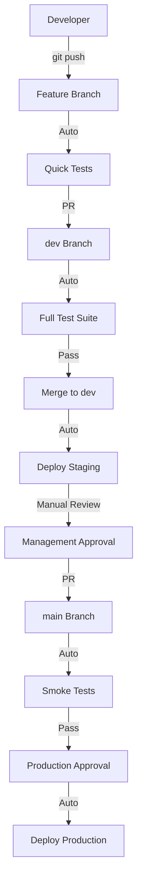

# CI/CD Architecture

## Overview

Our CI/CD pipeline implements a GitFlow-inspired branching strategy optimized for modern development practices with AI coding assistants. The architecture prioritizes rapid feedback, automated quality gates, and seamless progression from development to production.

## Architectural Decisions

### 1. Branch Strategy Decision

**Decision**: Use `dev` as the default branch instead of `main`

**Rationale**:
- AI coding assistants (GitHub Copilot, Claude, etc.) use the default branch for context
- Pull requests automatically target the default branch
- `main` remains protected as the production branch
- Developers get the latest integrated features as context for AI suggestions

**Trade-offs**:
- Deviates from GitHub's convention of `main` as default
- Requires clear documentation for new team members
- Benefits outweigh the convention when using AI assistants

### 2. Workflow Separation

**Decision**: Separate workflows by concern rather than a monolithic pipeline

**Rationale**:
- **Single Responsibility**: Each workflow has one clear purpose
- **Parallel Execution**: Workflows don't block each other
- **Maintainability**: Easier to modify individual workflows
- **Clarity**: Clear trigger conditions and purposes
- **Performance**: Only run necessary jobs for each event

**Implementation**:
```
.github/workflows/
├── feature-branch-tests.yml    # Quick feedback
├── pr-validation.yml           # Full validation
├── deploy-staging.yml          # Staging deployment
├── deploy-production.yml       # Production deployment
└── test-runner.yml             # (deprecated)
```

### 3. Progressive Testing Strategy with Serial E2E Execution

**Decision**: Serial E2E test execution with progressive categorization (see [ADR-001](./Decisions/0001-Serial-E2E-Testing.md))

**Current Strategy (Adopted 2025-08-28)**:
- **Architecture Constraint**: SQLite + EF Core requires serial execution
- **Execution Model**: Single worker (`workers: 1`) for all E2E tests
- **Test Categories**:
  - **Smoke Tests**: 2 minutes - Critical paths only (@smoke tag)
  - **Critical Tests**: 5 minutes - Core business features (@critical tag)
  - **Extended Tests**: 10 minutes - Comprehensive validation (@extended tag)
  - **Cross-Browser**: On-demand only (not in regular CI)



**Rationale**:
- **Feature branches**: Quick unit tests only (fast feedback)
- **Pull requests**: Full test suite (thorough validation)
- **Staging**: Post-deployment verification
- **Production**: Smoke tests + approval gates

### 4. Environment Strategy

**Decision**: Three-tier environment structure

1. **Development** (local) - Developer machines
2. **Staging** (automated) - Auto-deploy from `dev`
3. **Production** (gated) - Manual approval from `main`

**Rationale**:
- Staging provides real-world testing environment
- Management can review features before production
- Clear separation between testing and production

## Pipeline Architecture

### Flow Diagram



### Quality Gates

Each stage has specific quality gates:

| Stage | Quality Gates | Blocking |
|-------|--------------|----------|
| Feature Push | Unit tests, Linting | No |
| PR to dev | All tests, Code coverage, Linting | Yes |
| Deploy Staging | Build verification, Health checks | Yes |
| PR to main | Smoke tests, Management approval | Yes |
| Deploy Production | Environment approval, Health checks | Yes |

## Technical Implementation

### GitHub Actions Strategy

**Test Execution Strategy**:
- Backend and frontend unit tests run in parallel
- Integration tests run in parallel where possible
- **E2E tests run serially** (single worker, no parallelization)
- E2E tests run after unit tests complete

**Caching Strategy**:
- Node modules cached for Angular
- NuGet packages cached for .NET
- Build artifacts cached between jobs

**Resource Optimization**:
- SQLite for test databases (requires serial execution)
- Single shared server instance for all E2E tests
- Single headless browser (Chromium) for most tests
- No matrix builds for E2E (serial constraint)

### Security Considerations

1. **Secret Management**:
   - Environment-specific secrets
   - No secrets in workflow files
   - Rotation reminders configured

2. **Approval Gates**:
   - Production requires manual approval
   - Restricted merge permissions
   - Audit trail of all deployments

3. **Rollback Strategy**:
   - Previous artifacts retained for 1 day
   - Automated rollback on failure
   - Blue-green deployment ready

## Monitoring and Observability

### Metrics Tracked

- **Pipeline Metrics**:
  - Build success rate
  - Test pass rate
  - Deployment frequency
  - Lead time for changes
  - Mean time to recovery

- **Quality Metrics**:
  - Code coverage trends
  - Test execution time
  - Failed test analysis
  - Flaky test detection

### Notifications

- **Slack/Teams Integration**:
  - Deployment notifications
  - Test failure alerts
  - Production deployment announcements

- **GitHub Integration**:
  - PR status checks
  - Deployment status
  - Release notes generation

## Future Enhancements

### Short Term (1-3 months)
- [ ] Add performance testing to PR validation
- [ ] Implement automatic rollback triggers
- [ ] Add security scanning (SAST/DAST)
- [ ] Create deployment dashboards

### Medium Term (3-6 months)
- [ ] Implement blue-green deployments
- [ ] Add canary release support
- [ ] Create automated performance baselines
- [ ] Implement feature flags integration

### Long Term (6+ months)
- [ ] Multi-region deployment support
- [ ] A/B testing infrastructure
- [ ] Automated capacity planning
- [ ] ML-based anomaly detection

## Decision Log

| Date | Decision | Rationale |
|------|----------|-----------|
| 2024-08 | Separate workflows by concern | Maintainability and clarity |
| 2024-08 | Use dev as default branch | AI assistant compatibility |
| 2024-08 | SQLite for test databases | Cost and speed optimization |
| 2024-08 | Require PR reviews for dev | Code quality enforcement |
| 2025-08-28 | Serial E2E test execution | SQLite/EF Core constraints (ADR-001) |
| 2025-08-28 | Test categorization (@smoke, @critical, @extended) | Fast feedback with serial constraint |

## References

- [GitHub Actions Best Practices](https://docs.github.com/en/actions/guides)
- [GitFlow Workflow](https://nvie.com/posts/a-successful-git-branching-model/)
- [Trunk-Based Development](https://trunkbaseddevelopment.com/)
- [CI/CD Best Practices](https://www.atlassian.com/continuous-delivery/principles)